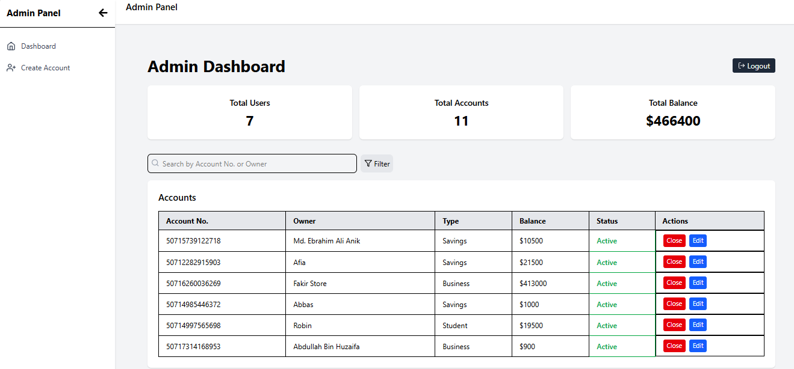
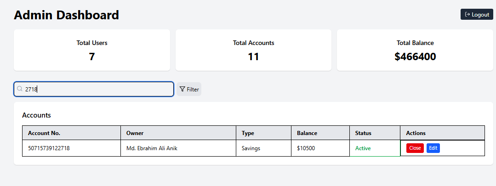
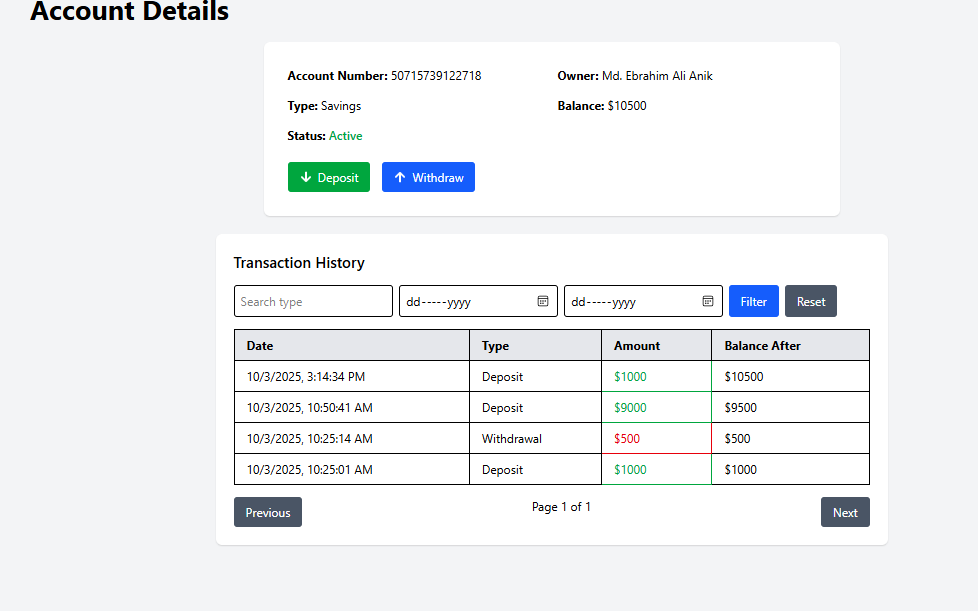

# FinTech Application

A full-stack **FinTech web application** built with the **MERN stack** (MongoDB, Express.js, React.js, Node.js). This application allows users to manage their accounts, perform deposits and withdrawals, and view analytics via an Admin Dashboard. The project is designed for modern financial management and provides a responsive and user-friendly interface.

---

## Table of Contents

- [Features](#features)
- [Tech Stack](#tech-stack)
- [Screenshots](#screenshots)
- [Getting Started](#getting-started)
- [Folder Structure](#folder-structure)
- [API Endpoints](#api-endpoints)
- [Contributing](#contributing)
- [License](#license)

---

## Features

- **User Management:** Sign up, login, and account management.
- **Account Operations:** Deposit, withdraw, and transfer funds.
- **Admin Dashboard:** View statistics of total users, total accounts, and account balances.
- **Filtering & Search:** Filter accounts based on type and search users.
- **Responsive Design:** Works on desktop and mobile devices.
- **Secure Authentication:** JWT-based authentication and authorization.

---

## Tech Stack

**Frontend:**

- React.js
- React Router
- Axios
- Tailwind CSS (or your CSS framework)
- React Icons
- React Redux
- React Router DOM
- React Toastify

**Backend:**

- Node.js
- Express.js
- MongoDB with Mongoose
- JWT for authentication
- bcryptjs for password hashing

**Tools & Utilities:**

- VSCode
- Git & GitHub
- Postman for API testing
- npm / Yarn
- dotenv for environment variables

---

## Screenshots

### Admin Dashboard


### Filtering Accounts


### Withdraw & Deposit Funds


---

## Getting Started
- Frontend:
  cd client
  npm install
- Backend:
  cd server
  npm instal
  
### Prerequisites

- Node.js >= 20.x
- npm or Yarn
- MongoDB instance (local or cloud)

### Installation

1. Clone the repository:
   ```bash
   git clone https://github.com/Ebrahim230/fintech
   cd fintech-app
\